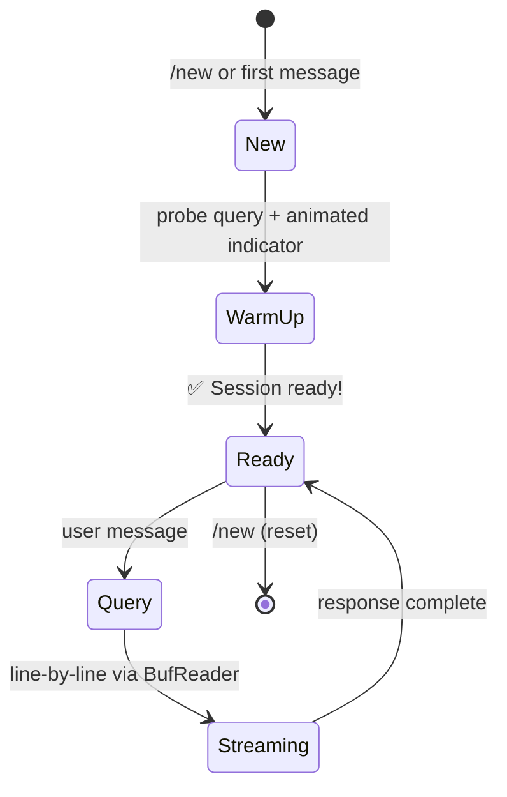

<p align="center">
  
</p>

<h1 align="center">toodles</h1>

<p align="center">
  <strong>Telegram × Gemini CLI — streamed responses, voice, file sharing & local transcription</strong>
</p>

<p align="center">
  <a href="#-quick-start">Quick Start</a> ·
  <a href="#-features">Features</a> ·
  <a href="#%EF%B8%8F-configuration">Config</a> ·
  <a href="#-architecture">Architecture</a>
</p>

<p align="center">
  
  
  
  
</p>

---

A Telegram bot written in Rust that wraps [`gemini-cli`](https://github.com/google-gemini/gemini-cli), letting you chat with Gemini AI directly from Telegram — with real-time streaming, voice transcription, file sharing, and per-topic session isolation.

## ✨ Features

| | Feature | Details |
|---|---|---|
| 💬 | **Real-time streaming** | Responses streamed line-by-line as gemini-cli generates them — via `sendMessageDraft` with `edit_message_text` fallback |
| 🚀 | **Session warm-up** | Animated `🚀 Starting Gemini session…` indicator while gemini-cli initialises |
| 📎 | **File sharing** | Gemini can send files back to you via the `ATTACH_FILE:` protocol |
| 🎙 | **Voice messages** | Transcribed locally via **Parakeet V3** or cloud via **OpenAI Whisper** |
| 🧠 | **Local transcription** | Offline, no API keys — NVIDIA Parakeet ONNX (int8, ~478 MB) |
| 📌 | **Forum topics** | Each Telegram topic gets an isolated gemini-cli session |
| 🔄 | **Session management** | `/new` starts fresh, `/status` shows active count |
| 🔒 | **Access control** | Optional user allowlist via `ALLOWED_USER_IDS` |
| 🧙 | **Setup wizard** | Interactive `--setup` generates `.env` with guided prompts |
| 🎨 | **Customisable prompt** | System prompt configurable via `SYSTEM_PROMPT` in `.env` |

## 🚀 Quick Start

### Prerequisites

- **Rust** ≥ 1.70 — [rustup.rs](https://rustup.rs)
- **gemini-cli** — `npm install -g @google/gemini-cli && gemini`
- **Telegram bot token** — [@BotFather](https://t.me/BotFather)
- **ffmpeg** — `brew install ffmpeg` *(required for voice messages)*
- *(Optional)* **OpenAI API key** — for cloud Whisper fallback

### Install & Run

```sh
git clone https://github.com/sleep3r/toodles
cd toodles

# Option A: Interactive setup wizard (recommended)
make setup

# Option B: Manual config
cp .env.example .env
$EDITOR .env

# Run
make run            # debug
make release        # optimized build
make run-release    # run optimized
```

## 💬 How It Works

```
 ┌───────────┐        ┌──────────┐        ┌──────────────┐
 │ Telegram  │───────▶│ toodles  │───────▶│  gemini-cli  │
 │   user    │◀─ edit │  (Rust)  │◀─ pipe │  subprocess  │
 └───────────┘  msg   └──────────┘  stdout└──────────────┘
```

1. User sends a message (text or voice)
2. On first message, toodles warms up gemini-cli with a probe query and shows an animated indicator
3. The actual query is streamed — each stdout line from gemini-cli is immediately forwarded to Telegram
4. Streaming uses `sendMessageDraft` (animated typing) with automatic `edit_message_text` fallback
5. Subsequent messages reuse the warmed session via `--resume latest`

## 🎙 Voice Transcription

toodles supports two transcription backends:

```
┌────────────────────┐     ┌──────────────┐     ┌───────────┐
│   Telegram Voice   │────▶│    ffmpeg     │────▶│ Parakeet  │──── text
│    (OGG Opus)      │     │  (16kHz f32)  │     │   V3 🦜   │
└────────────────────┘     └──────────────┘     └─────┬─────┘
                                                      │ fallback
                                                ┌─────▼─────┐
                                                │  OpenAI    │
                                                │ Whisper 🌐 │
                                                └───────────┘
```

| Mode | Latency | Cost | Setup |
|---|---|---|---|
| **Local** (Parakeet V3) | ~2-5s | Free | `--setup` downloads 478 MB model |
| **Cloud** (Whisper API) | ~1-3s | ~$0.006/min | Requires `OPENAI_API_KEY` |

If both are enabled, local transcription is tried first with automatic cloud fallback.

## ⚙️ Configuration

All configuration is managed through environment variables or `.env`:

```sh
# Required
TELEGRAM_BOT_TOKEN=123456:ABC-DEF...

# Access control (leave empty for unrestricted)
ALLOWED_USER_IDS=123456789,987654321

# Gemini CLI
GEMINI_CLI_PATH=gemini                # path to binary
GEMINI_WORKING_DIR=/path/to/project   # optional cwd

# System prompt — customise the bot's personality
SYSTEM_PROMPT=You are a helpful AI assistant. Keep answers concise.

# Voice — cloud (optional fallback)
OPENAI_API_KEY=sk-...

# Voice — local (recommended)
USE_LOCAL_TRANSCRIPTION=true
MODELS_DIR=~/.toodles/models

# Logging
RUST_LOG=info
```

> **💡 Tip:** Run `make setup` to generate this interactively!

## 🤖 Bot Commands

| Command | Description |
|---|---|
| `/start` | Приветствие и знакомство 👋 |
| `/new` | Начать с чистого листа 🔄 |
| `/status` | Статус бота 📊 |
| `/help` | Показать команды 💡 |

## 📐 Architecture

```
src/
├── main.rs             — entry point, dispatcher, bot commands
├── config.rs           — Config from env vars
├── session.rs          — gemini-cli subprocess: warm-up, streaming query
├── telegram_api.rs     — raw Telegram API (sendMessageDraft)
├── setup.rs            — interactive setup wizard (--setup)
├── transcription.rs    — Parakeet V3 engine + model download
└── handlers/
    ├── mod.rs           — shared: warm-up indicator, draft streaming, file sending
    ├── message.rs       — text message handler
    └── voice.rs         — voice handler (transcribe → query)
```

**Session lifecycle:**



Each chat or forum topic maps to an isolated gemini-cli session. Queries are serialised per session via `tokio::sync::Mutex`. Responses are streamed in real time — each line from gemini-cli stdout is sent to Telegram immediately via `sendMessageDraft` (with `edit_message_text` fallback).

## 🛠 Makefile

```sh
make help          # show all targets
make build         # debug build
make release       # optimized build
make run           # run (debug)
make run-release   # run (release)
make setup         # interactive setup wizard
make test          # run tests
make lint          # clippy
make fmt           # format code
make clean         # clean artifacts
```

## 📄 License

MIT — see [LICENSE](LICENSE).
