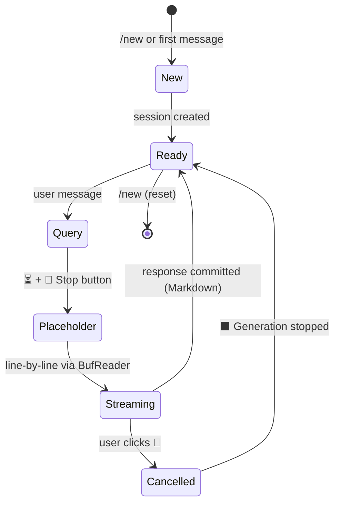

<p align="center">
  
</p>

<h1 align="center">toodles</h1>

<p align="center">
  <strong>Telegram × Gemini CLI — streamed responses, voice, file & photo sharing, local transcription</strong>
</p>

<p align="center">
  <a href="#-quick-start">Quick Start</a> ·
  <a href="#-features">Features</a> ·
  <a href="#%EF%B8%8F-configuration">Config</a> ·
  <a href="#-architecture">Architecture</a>
</p>

<p align="center">
  
  
  
  
</p>

---

A Telegram bot written in Rust that wraps [`gemini-cli`](https://github.com/google-gemini/gemini-cli), letting you chat with Gemini AI directly from Telegram — with real-time streaming, voice transcription, photo & file analysis, and per-topic session isolation.

## ✨ Features

| | Feature | Details |
|---|---|---|
| 💬 | **Real-time streaming** | Responses streamed line-by-line via `sendMessageDraft` with Markdown formatting and plain-text fallback |
| ⏳ | **Instant feedback** | "⏳" placeholder sent immediately — no dead silence while gemini-cli starts |
| 🛑 | **Stop generation** | Inline "🛑 Stop" button to cancel generation mid-stream — kills gemini-cli instantly |
| 📝 | **Smart message splitting** | Long responses auto-split into multiple Telegram messages at newline boundaries — no truncation |
| ⚠️ | **Error feedback** | Errors and timeouts (5 min) are reported to the user instead of silent failure |
| 📷 | **Photo analysis** | Send photos (including albums) — batched via aggregator and analyzed by Gemini Vision |
| 📄 | **Document handling** | Send files (PDF, XLSX, etc.) — downloaded and forwarded to gemini-cli for processing |
| 📎 | **File sharing** | Gemini can send files back via the `ATTACH_FILE:` protocol |
| 🧩 | **Message aggregation** | Sequential messages within 1.5s are batched into a single prompt — handles albums, forwarded batches, and split messages |
| 🎙 | **Voice messages** | Transcribed locally via **Parakeet V3** or cloud via **OpenAI Whisper** |
| 🧠 | **Local transcription** | Offline, no API keys — NVIDIA Parakeet ONNX (int8, ~478 MB) |
| 📌 | **Forum topics** | Each Telegram topic gets an isolated gemini-cli session |
| 🔄 | **Session management** | `/new` starts fresh, `/status` shows active count |
| 🔒 | **Access control** | Optional user allowlist via `ALLOWED_USER_IDS` |
| 🧙 | **Setup wizard** | Interactive `--setup` generates `.env` with guided prompts |
| 🎨 | **Customisable prompt** | System prompt configurable via `SYSTEM_PROMPT` in `.env` |
| ✅ | **Tested** | 68 unit tests covering aggregator, config, session management, cancellation, message splitting, and handler utilities |

## 🚀 Quick Start

### Prerequisites

- **Rust** ≥ 1.70 — [rustup.rs](https://rustup.rs)
- **gemini-cli** — `npm install -g @google/gemini-cli && gemini`
- **Telegram bot token** — [@BotFather](https://t.me/BotFather)
- **ffmpeg** — `brew install ffmpeg` *(required for voice messages)*
- *(Optional)* **OpenAI API key** — for cloud Whisper fallback

### Install & Run

```sh
git clone https://github.com/sleep3r/toodles
cd toodles

# Option A: Interactive setup wizard (recommended)
make setup

# Option B: Manual config
cp .env.example .env
$EDITOR .env

# Run
make run            # debug
make release        # optimized build
make run-release    # run optimized
```

## 💬 How It Works

```
 ┌───────────┐        ┌──────────┐        ┌──────────────┐
 │ Telegram  │───────▶│ toodles  │───────▶│  gemini-cli  │
 │   user    │◀─ edit │  (Rust)  │◀─ pipe │  subprocess  │
 └───────────┘  msg   └──────────┘  stdout└──────────────┘
```

1. User sends a message (text, photo, document, or voice)
2. Messages are aggregated within a 1.5s window (handles albums and split messages)
3. An instant "⏳" placeholder is sent with a 🛑 **Stop** inline button
4. The query is streamed — each stdout line from gemini-cli is forwarded to Telegram via `sendMessageDraft`
5. User can press **Stop** at any time — gemini-cli is killed instantly via `CancellationToken`
6. Final response is committed with Markdown formatting, split into multiple messages if needed (with automatic plain-text fallback)
7. Subsequent messages reuse the session via `--resume latest`

## 🎙 Voice Transcription

toodles supports two transcription backends:

```
┌────────────────────┐     ┌──────────────┐     ┌───────────┐
│   Telegram Voice   │────▶│    ffmpeg     │────▶│ Parakeet  │──── text
│    (OGG Opus)      │     │  (16kHz f32)  │     │   V3 🦜   │
└────────────────────┘     └──────────────┘     └─────┬─────┘
                                                      │ fallback
                                                ┌─────▼─────┐
                                                │  OpenAI    │
                                                │ Whisper 🌐 │
                                                └───────────┘
```

| Mode | Latency | Cost | Setup |
|---|---|---|---|
| **Local** (Parakeet V3) | ~2-5s | Free | `--setup` downloads 478 MB model |
| **Cloud** (Whisper API) | ~1-3s | ~$0.006/min | Requires `OPENAI_API_KEY` |

If both are enabled, local transcription is tried first with automatic cloud fallback.

## ⚙️ Configuration

All configuration is managed through environment variables or `.env`:

```sh
# Required
TELEGRAM_BOT_TOKEN=123456:ABC-DEF...

# Access control (leave empty for unrestricted)
ALLOWED_USER_IDS=123456789,987654321

# Gemini CLI
GEMINI_CLI_PATH=gemini                # path to binary
GEMINI_CLI_COMMAND=gemini --acp       # optional full ACP command
GEMINI_WORKING_DIR=/path/to/project   # optional cwd
GEMINI_YOLO=true                      # optional auto-approve mode
DRAFT_MODE=verbose                    # compact | verbose draft UX
THREAD_RENAME_EVERY=4                 # 0 disables auto-rename

# Optional: read additional settings from TOML
TOODLES_CONFIG=~/.config/toodles/config.toml

# System prompt — customise the bot's personality
SYSTEM_PROMPT=You are a helpful AI assistant. Keep answers concise.

# Voice — cloud (optional fallback)
OPENAI_API_KEY=sk-...

# Voice — local (recommended)
USE_LOCAL_TRANSCRIPTION=true
MODELS_DIR=~/.toodles/models

# Logging
RUST_LOG=info
```

> **💡 Tip:** Run `make setup` to generate this interactively!

### Optional TOML config

You can also keep settings in `~/.config/toodles/config.toml`:

```toml
bot_token = "123456:ABC-DEF..."
gemini_cli_command = "gemini --acp"
gemini_working_dir = "/path/to/project"
gemini_yolo = true
draft_mode = "verbose"
thread_rename_every = 4
```

You can copy `config.example.toml` as a starting point.

## 🤖 Bot Commands

| Command | Description |
|---|---|
| `/start` | Get started 👋 |
| `/new` | Start fresh 🔄 |
| `/status` | Bot status 📊 |
| `/thread` | Create forum thread 🧵 |
| `/help` | Show commands 💡 |

`/thread` works in forum-enabled supergroups where the bot has topic-management rights.
You can call `/thread` from both the main chat and existing topics; Toodles creates a new topic in the same group.
The first user message in a topic sets its initial title, then Toodles refreshes the title every `THREAD_RENAME_EVERY` messages using the recent message context.

## 📐 Architecture

```
src/
├── main.rs             — entry point, dispatcher, bot commands
├── config.rs           — Config from env + optional TOML (single gemini profile)
├── session.rs          — ACP session lifecycle + per-chat/topic session mapping
├── aggregator.rs       — message batching with debounce window + file guard ownership
├── telegram_api.rs     — raw Telegram API (sendMessageDraft), global HTTP client
├── setup.rs            — interactive setup wizard (--setup)
├── transcription.rs    — Parakeet V3 engine + model download
└── handlers/
    ├── mod.rs           — CancelRegistry, inline stop button, draft streaming, message splitting, Markdown→HTML
    ├── message.rs       — text message handler (with aggregation)
    ├── document.rs      — document/file handler (download + aggregate + query)
    ├── photo.rs         — photo handler (download + aggregate albums + query)
    └── voice.rs         — voice handler (transcribe → query)
```

**Session lifecycle:**



Each chat or forum topic maps to an isolated gemini-cli session. Queries are serialised per session via `tokio::sync::Mutex`. Responses are streamed in real time — each line from gemini-cli stdout is sent to Telegram immediately via `sendMessageDraft` (with `edit_message_text` commit). Users can cancel generation mid-stream via an inline keyboard button, which triggers a `CancellationToken` to kill the gemini-cli process. Long responses are automatically split across multiple Telegram messages at newline boundaries. Sequential messages and photo albums are aggregated via a 1.5s debounce window. Temporary files (photos, documents) are kept alive via `Arc<TempFileGuard>` in the aggregator until the query completes.

## 🛠 Makefile

```sh
make help          # show all targets
make build         # debug build
make release       # optimized build
make run           # run (debug)
make run-release   # run (release)
make setup         # interactive setup wizard
make test          # run tests
make lint          # clippy
make fmt           # format code
make clean         # clean artifacts
```

## 📄 License

MIT — see [LICENSE](LICENSE).
